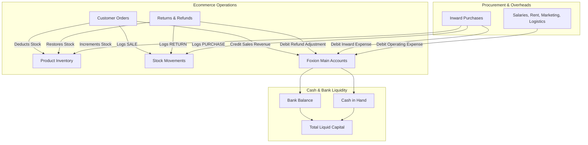

# Foxion Business Management System

A production-grade, unified business management suite and ERP built for **Foxion** — an ecommerce brand manufacturing and retailing physical consumer goods (rechargeable gas lighters, bluetooth speakers, kitchen appliances, and accessories) across multiple online channels (Amazon, Meesho, Flipkart, Direct Webstore, and Instagram).

The system integrates multi-channel order processing, dynamic inventory valuation with chronological stock movement tracking, procurement invoicing, an interactive spreadsheet ledger editor, single-ledger accounting (Main Accounts), cash/bank liquidity tracking, and operational analytics into a single Next.js 16 + MongoDB architecture.

---

## 🤖 AI Agent & LLM Project Context Guide

> **Note for AI Coding Assistants (Antigravity, Cursor, Copilot, Claude, ChatGPT, etc.):**  
> Read this section first before proposing edits, analyzing bugs, or writing code in this repository.

### System Identity & Architectural Patterns
- **Unified Single-Tier Application**: Built exclusively with Next.js 16 (App Router) and MongoDB via Mongoose. There are **no** separate backend microservices (no NestJS, Express, or Redis). Server endpoints exist under `app/api/` as Next.js Route Handlers.
- **Single Accounting Book Architecture**: The accounting engine has exactly **one accounting book: MAIN**. Every accounting transaction belongs to `MAIN`. There are no secondary books, no inter-book transfers, and no dual-book consolidation layers.
- **Service Layer Pattern**: All core business logic, database transactions, aggregations, and stock/accounting mutations **must** reside in `lib/services/`. API Route handlers (`app/api/`) and React Server Components act as lightweight controllers delegating to these services.
- **Zero-Dependency In-Memory DB Fallback**: `lib/db/connection.ts` automatically boots `mongodb-memory-server` if local or remote `MONGODB_URI` connection fails. Local tests and development runs can execute without an external database server running.
- **Strict Indian Business Calendar Dates (`DD/MM/YYYY`)**:
  - All financial and business dates operate in Indian Standard Time (`Asia/Kolkata`).
  - Never parse user dates using naive `new Date("YYYY-MM-DD")` in client browsers because UTC timezone offsets shift days.
  - Always use `formatIndianDate` / `parseIndianDate` helpers from `lib/utils.ts` and the `IndianDateInput` component.

### Non-Negotiable Core Invariants
1. **Single Accounting Book (MAIN)**:
   - All financial transactions belong to the single `MAIN` account ledger.
   - There is no separate `ECOMMERCE` account book or shared-bank consolidation layer.
2. **Atomic Multi-Entity Transitions**:
   - **Sales / Order Placement**: Creates `Order` $\rightarrow$ Deducts `Product.stock` $\rightarrow$ Logs `StockMovement` (type: `SALE`) $\rightarrow$ Creates `Transaction` in `MAIN` account (Credit).
   - **Order Return**: Restores `Product.stock` $\rightarrow$ Logs `StockMovement` (type: `RETURN`) $\rightarrow$ Creates refund adjustment `Transaction` in `MAIN` account (Debit).
   - **Inventory Procurement**: Saves `Purchase` invoice $\rightarrow$ Increments `Product.stock` $\rightarrow$ Logs `StockMovement` (type: `PURCHASE`) $\rightarrow$ Creates `Transaction` in `MAIN` account (Debit).
3. **Liquidity & Balances**:
   $$\text{Current Balance} = \text{Previous Balance} + \text{Credit} - \text{Debit}$$
   $$\text{Total Liquid Capital} = \text{Bank Balance} + \text{Cash Balance}$$
4. **Inventory Audit Integrity**:
   - Never modify `Product.stock` directly without logging an immutable `StockMovement` audit record.

---

## 🏗 System Architecture & Accounting Model

```text
                    FOXION ACCOUNTS
                          │
                          ▼
                    MAIN ACCOUNT
                          │
             ┌────────────┴────────────┐
             │                         │
        BANK LEDGER               CASH LEDGER
```



---

## 🚀 Key Modules & Capabilities

### 1. Main Accounts Ledger (`/accounts/main`)
- Single unified accounting ledger for all Foxion financial activity:
  - Product procurement and vendor supplier payments
  - Employee salaries, factory/office rent, and utilities
  - Multi-channel marketplace sales settlements and direct customer revenues
  - Platform commission fees, packaging costs, and shipping courier charges
  - Customer return refunds and adjustments
  - Capital introduced and bank/cash transfers
- Real-time running balance calculation: $\text{Current} = \text{Prev} + \text{Credit} - \text{Debit}$.
- Filterable by date range, category, payment mode (`Bank Transfer`, `UPI`, `Cash`, `Marketplace`, etc.), and payment channel (`Bank` vs `Cash`).
- Inline bill attachment metadata linkage.

### 2. Interactive Excel Spreadsheet Import & In-Table Editor (`/accounts/import`)
- Full in-table spreadsheet review and editing before committing records into MongoDB.
- **Capabilities**:
  - Drag-and-drop `.xlsx` / `.xls` upload.
  - Inline editable cells with keyboard navigation (`Enter` to save, `Esc` to cancel).
  - Dynamic real-time calculation of running balances upon editing debit or credit values.
  - Row manipulation: `+ Add Row`, `Duplicate Row`, and `Delete Row`.
  - Live validation engine: Instant cell error highlighting (e.g. invalid date format, missing party, negative amounts).
  - Filter by search keyword and `Show Errors Only` toggle.
  - Pre-commit modal displaying summary statistics (total debit, total credit, modified rows, zero-error confirmation).
  - Atomic persistence directly into Main Accounts with `ImportBatch` audit logs.

### 3. Inventory & Catalog Engine (`/inventory`)
- **Products Catalog (`/inventory/products`)**: SKU codes, barcodes, cost prices (CP), selling prices (SP), current stock, and min reorder thresholds.
- **Stock Audit Ledger (`/inventory/movements`)**: Immutable chronological log of all stock movements with source references (`PURCHASE`, `SALE`, `RETURN`, `ADJUSTMENT`).
- **Stock Valuation (`/inventory/stock`)**: Real-time holding valuation based on unit purchase cost.

### 4. Multi-Channel Ecommerce Operations (`/ecommerce`)
- **Order Processing (`/ecommerce/orders`)**: Record orders across Amazon, Meesho, Flipkart, Direct Webstore, and Instagram with automatic stock deduction and revenue recording.
- **Sales Analytics (`/ecommerce/sales`)**: Unit-level profitability, gross profit, and platform fees.
- **Returns Management (`/ecommerce/returns`)**: Return handling with automated inventory restock and refund ledger debit entries.
- **Platform Management (`/ecommerce/platforms`)**: Commission rates, platform codes, and performance metrics.

### 5. Procurement & Vendor Bills (`/purchases` & `/bills`)
- Inward purchase invoice tracking with supplier party linkages, payment modes, and GST input credit.
- Document storage for scanned bills, invoices, and payment receipts (`/api/bills/upload`).

### 6. Reports & Financial Intelligence (`/reports`)
- **Profit & Loss (`/reports/pnl`)**: Gross Sales Revenue minus COGS, Marketplace Fees, and Shipping $\rightarrow$ Gross Profit; minus Operating Overheads $\rightarrow$ Net Profit.
- **Sales Report (`/reports/sales`)**: Channel breakdowns, item-level unit economics.
- **Purchases Report (`/reports/purchases`)**: Supplier procurement breakdown and Input Tax Credit (ITC).
- **Expense Breakdown (`/reports/expenses`)**: Categorical overhead analysis and Bank vs Cash disbursements.
- **Inventory Valuation (`/reports/inventory`)**: Current stock on hand at cost, holding value, and critical reorder alerts.
- **GST Report (`/reports/gst`)**: Output GST collected on sales vs Input Tax Credit on procurement.
- **Cash Flow (`/reports/cashflow`)**: Bank vs Cash liquidity trends over time.

---

## 📊 Accounting Excel Template (16 Columns)

The Excel Import & Export system conforms strictly to this 16-column format:

| # | Column Header | Type | Description / Constraints |
|---|---|---|---|
| 1 | `Sl No` | Auto / Number | Sequential row number (1, 2, 3...) |
| 2 | `Date` | Date (`DD/MM/YYYY`) | Indian calendar date e.g. `17/09/2026` |
| 3 | `Description` | String | Narration / transaction details |
| 4 | `Category` | String | Account category head (e.g. `Salaries`, `Packaging`, `Settlement`) |
| 5 | `Debit` | Number | Expense / cash outflow ($\ge 0$) |
| 6 | `Credit` | Number | Income / sales inflow ($\ge 0$) |
| 7 | `Payment Mode` | String | `Bank Transfer`, `UPI`, `Cash`, `Card`, `Marketplace` |
| 8 | `Bank/Cash` | String | `Bank`, `Cash`, or `N/A` |
| 9 | `Party Name` | String | Vendor, supplier, customer, or marketplace name |
| 10 | `Invoice/orderId`| String | Reference invoice number or order ID |
| 11 | `GST Applicable`| Boolean | `Yes` / `No` |
| 12 | `GST Amount` | Number | GST tax component |
| 13 | `TDS/TCS` | Number | Tax deducted/collected at source |
| 14 | `Balance` | Auto / Number | Running balance ($\text{Previous} + \text{Credit} - \text{Debit}$) |
| 15 | `Remarks` | String | Optional audit notes |
| 16 | `Bill Available`| Boolean | `Yes` / `No` |

---

## 📁 Repository Layout & File Map

```
ecom/
├── app/                                 # Next.js 16 App Router
│   ├── (auth)/login/                    # Authentication login page
│   ├── accounts/                        # Accounts module
│   │   ├── main/                        # Single Foxion Main accounts ledger
│   │   └── import/                      # Interactive Excel import & editor
│   ├── api/                             # Server API Route Handlers
│   │   ├── auth/                        # Login, logout, session verification
│   │   ├── bills/                       # Bill storage and upload
│   │   ├── dashboard/                   # Aggregated KPI and chart data
│   │   ├── excel/                       # Import, export, and spreadsheet validation
│   │   ├── orders/                      # Orders and return processing
│   │   ├── products/                    # Product CRUD and catalog
│   │   ├── purchases/                   # Purchase invoices
│   │   ├── reports/                     # Report generation endpoints
│   │   └── transactions/                # Main transaction CRUD
│   ├── bills/                           # Document and receipt repository
│   ├── dashboard/                       # Executive KPI dashboard and Recharts
│   ├── ecommerce/                       # Orders, sales, returns, platforms
│   ├── inventory/                       # Products, stock levels, movements
│   ├── purchases/                       # Inward purchase invoice manager
│   ├── reports/                         # P&L, GST, Cashflow, Sales, Inventory
│   └── settings/                        # System settings & configuration
├── components/                          # React UI Components
│   ├── accounts/                        # AccountsLedgerView, TransactionFormModal
│   ├── dashboard/                       # Dashboard chart components (Recharts)
│   ├── ecommerce/                       # Order forms and return modals
│   ├── layout/                          # AppLayout, Header, Sidebar navigation
│   ├── inventory/                       # Product forms and stock components
│   ├── purchases/                       # Purchase invoice modal
│   └── ui/                              # Primitives (IndianDateInput, Modal, Card, Button...)
├── lib/                                 # Business Logic & Infrastructure
│   ├── auth/                            # JWT session and password hashing (Jose + bcrypt)
│   ├── db/                              # MongoDB connection with MongoMemoryServer fallback
│   ├── excel/                           # SheetJS parser, validator, importer, exporter
│   ├── models/                          # Mongoose schemas and models
│   │   ├── Bill.ts                      # Attached document metadata
│   │   ├── Category.ts                  # Taxonomy heads (Product & Expense)
│   │   ├── ImportBatch.ts               # Excel import history & audits
│   │   ├── Order.ts                     # Marketplace sales orders
│   │   ├── Party.ts                     # Vendors, suppliers, customers
│   │   ├── Platform.ts                  # Ecommerce marketplace platforms
│   │   ├── Product.ts                   # SKU inventory items
│   │   ├── Purchase.ts                  # Inward procurement records
│   │   ├── StockMovement.ts             # Chronological stock movement audit trail
│   │   ├── Transaction.ts               # Main accounting transactions
│   │   └── User.ts                      # System user & role authentication
│   ├── services/                        # Core service layer
│   │   ├── dashboardService.ts          # KPI calculations & chart series
│   │   ├── inventoryService.ts          # Stock and movement mutations
│   │   ├── orderService.ts              # Order placement & return lifecycle
│   │   ├── purchaseService.ts           # Inward purchases & stock updates
│   │   ├── reportService.ts             # Financial report aggregations
│   │   └── transactionService.ts        # Transaction CRUD, balances & liquid metrics
│   └── utils.ts                         # Currency formatting (INR), date helpers, classNames
└── scripts/                             # Utility and test scripts
    ├── clear-dummy-data.ts              # Purges demo data while keeping admin/taxonomy
    └── seed.ts                          # Seeds standard catalog, platforms & initial accounts
```

---

## 🛠 Technology Stack

- **Framework**: Next.js 16 (App Router)
- **Runtime & UI**: React 19, Lucide React icons, Sonner toast notifications
- **Language**: Strict TypeScript 5 (no `any`)
- **Database**: MongoDB 7+ & Mongoose 9 (with `mongodb-memory-server` in-memory fallback)
- **Styling**: Tailwind CSS v4 & custom dark-mode business design system
- **Charts & Visualizations**: Recharts
- **Spreadsheets**: SheetJS (`xlsx`)
- **Authentication**: Stateless JWT via `jose` and `bcryptjs`
- **Validation**: Zod + React Hook Form

---

## ⚙️ Environment Variables

Create `.env.local` in the project root:

```env
# MongoDB Connection String (Atlas URI or local mongod)
# If omitted or offline, the app automatically falls back to an in-memory database
MONGODB_URI=mongodb+srv://<username>:<password>@cluster.mongodb.net/ecom?appName=Cluster

# Authentication Secret (minimum 32 characters for JWT signing)
AUTH_SECRET=foxion_super_secret_jwt_key_min_32_chars_long_foxion_2026

# Application Base URL
NEXT_PUBLIC_APP_URL=http://localhost:3000

# Bill and Invoice Upload Storage Directory
UPLOAD_DIR=public/uploads

# Default Admin Credentials
ADMIN_EMAIL=admin@foxion.in
ADMIN_PASSWORD=Ecom_Foxion_Password@2026
```

Refer to [`.env.example`](file:///.env.example) for the starter template.

---

## 🚦 Getting Started

### 1. Installation
```bash
npm install
```

### 2. Database Seeding
Seed the administrator account (`admin@foxion.in` / `Ecom_Foxion_Password@2026`), standard product categories, ecommerce platforms, and sample catalog items:

```bash
npm run seed
```

### 3. Launch Development Server
```bash
npm run dev
```

Open [http://localhost:3000](http://localhost:3000) in your browser:
- **Email**: `admin@foxion.in`
- **Password**: `Ecom_Foxion_Password@2026`

---

## 🧪 Testing & Database Maintenance

### Purging Test Data (Clean Production State)
To delete dummy orders, test purchases, and trial transactions while preserving admin credentials, categories, and platforms:

```bash
npm run clean
```

### Type Checking & Production Build
```bash
# Type check
npx tsc --noEmit

# Production build
npm run build

# Start production server
npm run start
```

---

## 📝 Conventions & Developer Rules

1. **Single Accounting Ledger**:
   - Never introduce separate transaction books or inter-book transfer logic. All financial mutations write to `MAIN`.
2. **Next.js 16 Directives**:
   - Client components must include `"use client"` at the very top.
   - Dynamic route params in Next.js 16 are Promises: `const { id } = await params;`.
3. **Database Connectivity**:
   - Always call `await connectDB()` at the entry of server routes or service functions.
4. **Number & Date Formatting**:
   - Use `formatINR(value)` from `lib/utils.ts` for Indian Rupee currency display (`₹1,23,456.00`).
   - Use `formatIndianDate` / `IndianDateInput` for dates (`DD/MM/YYYY`).
5. **No Blind State Overwrites**:
   - Never directly modify `Product.stock` without recording a corresponding `StockMovement`.
